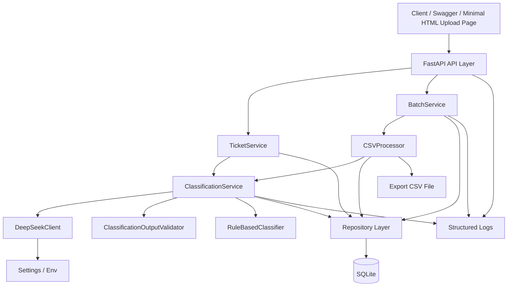
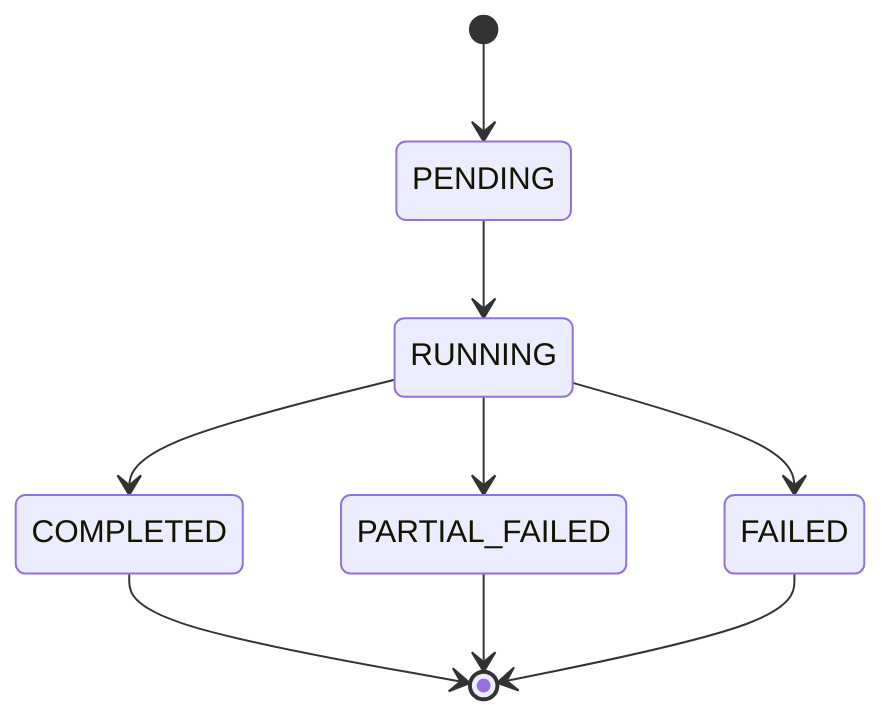
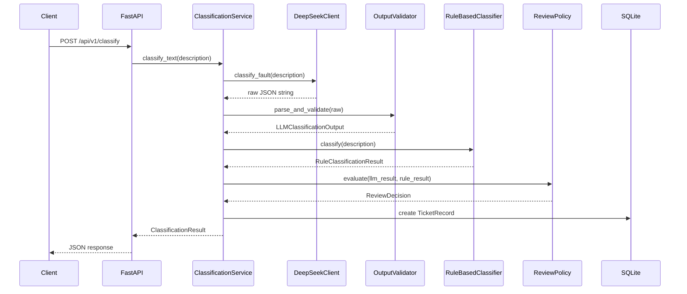
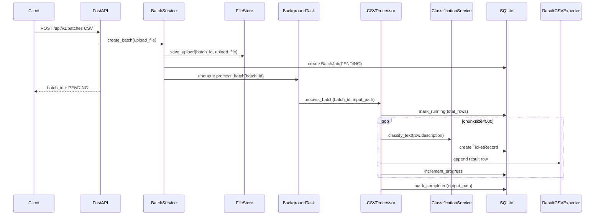

# architecture.md

## 元信息

- 项目名称：NetTriage AI
- 中文名：网络故障工单智能分诊系统
- 阶段：Init / 阶段 2 架构设计
- 日期：2026-05-06
- 版本：v1
- 技术路线：FastAPI + DeepSeek API + Pydantic v2 + Pandas + SQLModel/SQLite
- 部署目标：单云服务器 Docker 部署
- 主要目标：输入网络故障描述，自动分类、生成摘要、输出排查建议，支持 CSV 批量处理和历史查询

---

## 1. 架构结论

v1 采用“模块化单体后端”架构，不拆微服务，不引入前端 SPA，不引入 Celery/Redis，不引入 PostgreSQL。

原因：

1. 当前是从 0 起步，无真实工单样例和标注数据，核心风险在分类稳定性，不在服务拆分。
2. 单云服务器部署下，FastAPI + SQLite + BackgroundTasks 足够支撑 v1 验证。
3. LLM 输出不可完全信任，必须把 DeepSeek 调用、JSON 校验、规则兜底、人工复核标记拆成独立层。
4. CSV 批处理必须和单条分类共用同一套 `ClassificationService`，避免批量和单条行为不一致。
5. repository 层隔离数据库，后续可迁移 PostgreSQL；task 层隔离批处理，后续可迁移 Celery/RQ。

---

## 2. 架构总览



---

## 3. 模块划分

### 3.1 API 层

目录：`src/nettriage/api/`

职责：

- 暴露 HTTP 接口。
- 做请求级参数校验。
- 调用 service 层。
- 返回统一响应格式。
- 不直接访问数据库。
- 不直接调用 DeepSeek API。
- 不写分类规则。

核心文件：

```text
src/nettriage/api/main.py
src/nettriage/api/routes/health.py
src/nettriage/api/routes/classify.py
src/nettriage/api/routes/batches.py
src/nettriage/api/routes/tickets.py
src/nettriage/api/dependencies.py
src/nettriage/api/errors.py
```

核心接口：

#### `POST /api/v1/classify`

用途：单条工单分类。

请求：

```json
{
  "description": "用户反馈办公区 Wi-Fi 信号弱，经常掉线，视频会议卡顿",
  "ticket_id": "T-10001",
  "source": "manual",
  "customer_region": "Shanghai-Pudong"
}
```

响应：

```json
{
  "ticket_id": "T-10001",
  "primary_category": "WEAK_SIGNAL",
  "secondary_categories": ["DROPPED_CONNECTION", "HIGH_LATENCY"],
  "confidence": 0.84,
  "review_required": false,
  "review_reasons": [],
  "key_symptoms": ["Wi-Fi 信号弱", "经常掉线", "视频会议卡顿"],
  "summary": "用户反馈办公区无线信号弱，并伴随掉线和实时会议卡顿。",
  "troubleshooting_steps": [
    "确认终端位置、AP 覆盖范围和 RSSI/SINR 指标。",
    "检查 AP 在线状态、信道干扰和接入用户数量。",
    "复测有线网络与无线网络差异，定位是否为无线侧问题。"
  ],
  "record_id": 1,
  "processed_at": "2026-05-06T12:00:00Z"
}
```

#### `POST /api/v1/batches`

用途：上传 CSV 并创建批处理任务。

约束：

- 文件扩展名必须为 `.csv`。
- 文件大小上限：20 MB。
- 如果无法识别描述字段，创建失败。
- 接口返回 `batch_id`，不等待整个 CSV 处理完成。

响应：

```json
{
  "batch_id": "batch_20260506_000001",
  "status": "PENDING",
  "received_rows": 0,
  "message": "Batch accepted"
}
```

#### `GET /api/v1/batches/{batch_id}`

用途：查询批处理状态。

响应：

```json
{
  "batch_id": "batch_20260506_000001",
  "status": "RUNNING",
  "total_rows": 10000,
  "processed_rows": 2500,
  "success_rows": 2400,
  "failed_rows": 100,
  "review_required_rows": 680,
  "created_at": "2026-05-06T12:00:00Z",
  "completed_at": null,
  "error_message": null
}
```

#### `GET /api/v1/batches/{batch_id}/download`

用途：下载批处理结果 CSV。

#### `GET /api/v1/tickets`

用途：查询历史分类结果。

查询参数：

- `primary_category`
- `review_required`
- `batch_id`
- `keyword`
- `limit`
- `offset`

#### `PATCH /api/v1/tickets/{record_id}/review`

用途：更新人工复核状态。

请求：

```json
{
  "review_status": "CONFIRMED",
  "reviewed_category": "WEAK_SIGNAL",
  "review_note": "现场 AP 信号弱，与模型判断一致"
}
```

---

### 3.2 Schema 层

目录：`src/nettriage/schemas/`

职责：

- 定义 API 请求/响应模型。
- 定义 LLM 输出模型。
- 定义内部业务 DTO。
- 统一枚举与校验规则。

核心文件：

```text
src/nettriage/schemas/enums.py
src/nettriage/schemas/classification.py
src/nettriage/schemas/ticket.py
src/nettriage/schemas/batch.py
src/nettriage/schemas/common.py
```

核心枚举：

```python
class FaultCategory(str, Enum):
    COVERAGE_ISSUE = "COVERAGE_ISSUE"
    DROPPED_CONNECTION = "DROPPED_CONNECTION"
    HIGH_LATENCY = "HIGH_LATENCY"
    DNS_FAILURE = "DNS_FAILURE"
    AUTH_FAILURE = "AUTH_FAILURE"
    DEVICE_FAILURE = "DEVICE_FAILURE"
    WEAK_SIGNAL = "WEAK_SIGNAL"
    CONFIG_ERROR = "CONFIG_ERROR"
    PACKET_LOSS = "PACKET_LOSS"
    BANDWIDTH_DEGRADATION = "BANDWIDTH_DEGRADATION"
    SERVICE_OUTAGE = "SERVICE_OUTAGE"
    CUSTOMER_PREMISES_ISSUE = "CUSTOMER_PREMISES_ISSUE"
    UNKNOWN = "UNKNOWN"
```

核心模型：

```python
class ClassifyRequest(BaseModel):
    description: str = Field(min_length=1, max_length=4000)
    ticket_id: str | None = None
    source: str | None = None
    customer_region: str | None = None
    created_at: datetime | None = None


class LLMClassificationOutput(BaseModel):
    primary_category: FaultCategory
    secondary_categories: list[FaultCategory] = Field(default_factory=list)
    confidence: float = Field(ge=0.0, le=1.0)
    category_scores: dict[FaultCategory, float] = Field(default_factory=dict)
    key_symptoms: list[str] = Field(default_factory=list)
    summary: str = Field(min_length=1, max_length=500)
    troubleshooting_steps: list[str] = Field(min_length=1, max_length=8)


class ClassificationResult(BaseModel):
    primary_category: FaultCategory
    secondary_categories: list[FaultCategory]
    confidence: float
    category_scores: dict[FaultCategory, float]
    key_symptoms: list[str]
    summary: str
    troubleshooting_steps: list[str]
    review_required: bool
    review_reasons: list[str]
    llm_raw_output: str | None = None
    llm_latency_ms: int | None = None
    fallback_used: bool = False
    error: str | None = None
```

---

### 3.3 LLM 层

目录：`src/nettriage/llm/`

职责：

- 封装 DeepSeek API 调用。
- 统一超时、重试、错误映射。
- 不处理业务分类规则。
- 不直接写数据库。

核心文件：

```text
src/nettriage/llm/base.py
src/nettriage/llm/deepseek.py
src/nettriage/llm/prompts.py
src/nettriage/llm/errors.py
```

核心接口：

```python
class LLMClient(Protocol):
    async def classify_fault(self, description: str) -> LLMRawResponse:
        ...


@dataclass(frozen=True)
class LLMRawResponse:
    content: str
    model: str
    latency_ms: int
    request_id: str | None = None
```

`DeepSeekClient.classify_fault()` 行为要求：

1. 使用 `Settings.deepseek_api_key`、`Settings.deepseek_base_url`、`Settings.deepseek_model`。
2. 设置 `response_format={"type": "json_object"}`。
3. system prompt 必须包含 `json` 字样和输出字段说明。
4. user prompt 必须只包含故障描述和分类任务，不拼接不可信执行指令。
5. API 超时默认 30 秒。
6. 429/5xx 最多指数退避重试 2 次。
7. 空 content 视为 `LLMEmptyResponseError`。
8. 不在日志中记录完整故障描述。

Prompt 文件：

```python
CLASSIFICATION_SYSTEM_PROMPT = """
You are a telecom network trouble-ticket classification engine.
Return only valid JSON.
...
"""
```

---

### 3.4 分类服务层

目录：`src/nettriage/services/`

职责：

- 组织 LLM、校验器、规则引擎和 repository。
- 生成最终业务结果。
- 决定是否人工复核。
- 保存单条工单与批处理结果。

核心文件：

```text
src/nettriage/services/classification_service.py
src/nettriage/services/ticket_service.py
src/nettriage/services/batch_service.py
src/nettriage/services/review_service.py
```

核心类：

```python
class ClassificationService:
    def __init__(
        self,
        llm_client: LLMClient,
        validator: ClassificationOutputValidator,
        rule_classifier: RuleBasedClassifier,
        ticket_repository: TicketRepository,
        settings: Settings,
    ) -> None:
        ...

    async def classify_text(
        self,
        description: str,
        ticket_id: str | None = None,
        source: str | None = None,
        customer_region: str | None = None,
        batch_id: str | None = None,
    ) -> ClassificationResult:
        ...
```

`ClassificationService.classify_text()` 固定流程：

1. `TextNormalizer.normalize(description)`
2. `InputGuard.validate_description(normalized_description)`
3. 调用 `DeepSeekClient.classify_fault()`
4. `ClassificationOutputValidator.parse_and_validate(raw.content)`
5. `RuleBasedClassifier.classify(normalized_description)`
6. `ReviewPolicy.evaluate(llm_result, rule_result, description)`
7. 组装 `ClassificationResult`
8. `TicketRepository.create_result(...)`
9. 返回结果

失败流程：

1. JSON parse/Pydantic 校验失败：重试 1 次修复 JSON。
2. LLM 调用失败：规则兜底。
3. 规则兜底仍无法命中：`primary_category=UNKNOWN`。
4. 所有降级结果必须 `review_required=true`。
5. 所有错误只保存错误类型和摘要，不保存堆栈到 API 响应。

---

### 3.5 规则引擎层

目录：`src/nettriage/rules/`

职责：

- 关键词权重分类。
- 检测信息不足。
- 检测多类别冲突。
- 检测 LLM 与规则主类冲突。

核心文件：

```text
src/nettriage/rules/rule_classifier.py
src/nettriage/rules/keyword_rules.py
src/nettriage/rules/review_policy.py
src/nettriage/rules/text_normalizer.py
```

核心类：

```python
class RuleBasedClassifier:
    def classify(self, description: str) -> RuleClassificationResult:
        ...


class ReviewPolicy:
    def evaluate(
        self,
        llm_result: LLMClassificationOutput | None,
        rule_result: RuleClassificationResult,
        parse_error: str | None = None,
    ) -> ReviewDecision:
        ...
```

关键词权重示例：

```python
KEYWORD_RULES = {
    FaultCategory.DNS_FAILURE: {
        "dns": 3,
        "域名解析": 3,
        "能ping ip": 3,
        "无法解析": 2,
    },
    FaultCategory.AUTH_FAILURE: {
        "认证失败": 3,
        "账号密码": 2,
        "pppoe": 3,
        "radius": 3,
    },
    FaultCategory.WEAK_SIGNAL: {
        "信号弱": 3,
        "rssi": 3,
        "sinr": 3,
        "wifi弱": 2,
    },
}
```

复核规则：

```text
confidence < 0.80                          -> REVIEW_LOW_CONFIDENCE
top1_score - top2_score < 0.08              -> REVIEW_CATEGORY_CONFLICT
description length < 8 CJK chars            -> REVIEW_INSUFFICIENT_INFORMATION
LLM primary != rule primary and rule strong  -> REVIEW_RULE_LLM_CONFLICT
JSON parse failed or fallback used           -> REVIEW_FALLBACK_USED
```

---

### 3.6 CSV 批处理层

目录：`src/nettriage/batch/`

职责：

- 接收上传文件后复制到受控临时目录。
- 做 CSV 字段识别和清洗。
- 按 chunk 读取。
- 逐行调用 `ClassificationService.classify_text()`。
- 写入 SQLite 和结果 CSV。
- 更新批处理状态。

核心文件：

```text
src/nettriage/batch/csv_processor.py
src/nettriage/batch/field_mapper.py
src/nettriage/batch/exporter.py
src/nettriage/batch/file_store.py
```

核心类：

```python
class CSVProcessor:
    async def process_batch(self, batch_id: str, input_path: Path) -> None:
        ...


class CSVFieldMapper:
    def infer_mapping(self, columns: list[str]) -> CSVFieldMapping:
        ...


class ResultCSVExporter:
    def append_row(self, batch_id: str, result: ClassificationResult) -> None:
        ...
```

字段映射：

```python
DESCRIPTION_ALIASES = {
    "description",
    "desc",
    "content",
    "fault_description",
    "problem_description",
    "故障描述",
    "问题描述",
    "故障现象",
}

TICKET_ID_ALIASES = {
    "ticket_id",
    "id",
    "case_id",
    "order_id",
    "工单号",
    "工单编号",
}
```

批处理约束：

- 文件大小上限：20 MB。
- 行数硬上限：50,000。
- 默认 `chunksize=500`。
- 每行独立错误隔离，一行失败不影响整个批次。
- 上传文件名不得直接用于落盘路径。
- 后台任务开始前必须把 `UploadFile` 内容复制到 `data/uploads/{batch_id}.csv`，避免请求结束后文件句柄关闭。

批处理状态机：



---

### 3.7 数据访问层

目录：`src/nettriage/db/`、`src/nettriage/repositories/`

职责：

- 管理数据库连接。
- 定义 SQLModel 表。
- 提供 repository 方法。
- 不暴露 SQLModel Session 给 API 层。

核心文件：

```text
src/nettriage/db/session.py
src/nettriage/db/init_db.py
src/nettriage/db/models.py
src/nettriage/repositories/ticket_repository.py
src/nettriage/repositories/batch_repository.py
```

SQLModel 表：

```python
class TicketRecord(SQLModel, table=True):
    id: int | None = Field(default=None, primary_key=True)
    ticket_id: str = Field(index=True)
    batch_id: str | None = Field(default=None, index=True)

    description_hash: str = Field(index=True)
    description_text: str

    primary_category: str = Field(index=True)
    secondary_categories_json: str
    confidence: float = Field(index=True)
    category_scores_json: str

    key_symptoms_json: str
    summary: str
    troubleshooting_steps_json: str

    review_required: bool = Field(index=True)
    review_status: str = Field(default="PENDING", index=True)
    review_reasons_json: str
    reviewed_category: str | None = None
    review_note: str | None = None

    llm_model: str | None = None
    llm_raw_output: str | None = None
    llm_latency_ms: int | None = None
    fallback_used: bool = False
    error: str | None = None

    source: str | None = None
    customer_region: str | None = None
    created_at: datetime | None = None
    processed_at: datetime = Field(default_factory=datetime.utcnow, index=True)


class BatchJob(SQLModel, table=True):
    id: int | None = Field(default=None, primary_key=True)
    batch_id: str = Field(unique=True, index=True)

    input_filename: str
    stored_input_path: str
    output_path: str | None = None

    status: str = Field(default="PENDING", index=True)
    total_rows: int = 0
    processed_rows: int = 0
    success_rows: int = 0
    failed_rows: int = 0
    review_required_rows: int = 0

    error_message: str | None = None
    created_at: datetime = Field(default_factory=datetime.utcnow, index=True)
    started_at: datetime | None = None
    completed_at: datetime | None = None
```

SQLite 初始化要求：

```sql
PRAGMA journal_mode=WAL;
PRAGMA foreign_keys=ON;
PRAGMA busy_timeout=5000;
PRAGMA synchronous=NORMAL;
```

Repository 接口：

```python
class TicketRepository:
    def create_result(self, data: TicketRecordCreate) -> TicketRecord:
        ...

    def list_results(self, filters: TicketQueryFilters) -> list[TicketRecord]:
        ...

    def update_review_status(
        self,
        record_id: int,
        review_status: ReviewStatus,
        reviewed_category: FaultCategory | None,
        review_note: str | None,
    ) -> TicketRecord:
        ...


class BatchRepository:
    def create_batch(self, data: BatchJobCreate) -> BatchJob:
        ...

    def mark_running(self, batch_id: str, total_rows: int) -> None:
        ...

    def increment_progress(
        self,
        batch_id: str,
        success_delta: int,
        failed_delta: int,
        review_required_delta: int,
    ) -> None:
        ...

    def mark_completed(self, batch_id: str, output_path: str) -> None:
        ...

    def mark_failed(self, batch_id: str, error_message: str) -> None:
        ...
```

---

### 3.8 配置层

目录：`src/nettriage/core/`

核心文件：

```text
src/nettriage/core/config.py
src/nettriage/core/logging.py
src/nettriage/core/security.py
```

`Settings`：

```python
class Settings(BaseSettings):
    app_name: str = "NetTriage AI"
    environment: str = "dev"

    deepseek_api_key: SecretStr
    deepseek_base_url: AnyHttpUrl = "https://api.deepseek.com"
    deepseek_model: str = "deepseek-chat"
    deepseek_timeout_seconds: int = 30
    deepseek_max_retries: int = 2

    database_url: str = "sqlite:///./data/nettriage.db"

    upload_dir: Path = Path("./data/uploads")
    export_dir: Path = Path("./data/exports")
    max_upload_mb: int = 20
    max_csv_rows: int = 50000
    csv_chunksize: int = 500

    review_confidence_threshold: float = 0.80
    conflict_score_delta: float = 0.08

    log_level: str = "INFO"
```

`.env.example`：

```env
APP_NAME="NetTriage AI"
ENVIRONMENT=dev
DEEPSEEK_API_KEY=replace-me
DEEPSEEK_BASE_URL=https://api.deepseek.com
DEEPSEEK_MODEL=deepseek-chat
DATABASE_URL=sqlite:///./data/nettriage.db
MAX_UPLOAD_MB=20
MAX_CSV_ROWS=50000
CSV_CHUNKSIZE=500
REVIEW_CONFIDENCE_THRESHOLD=0.80
CONFLICT_SCORE_DELTA=0.08
```

---

## 4. 数据流

### 4.1 单条分类数据流



### 4.2 CSV 批处理数据流



---

## 5. 目录结构

```text
nettriage-ai/
├── pyproject.toml
├── uv.lock
├── README.md
├── .env.example
├── .gitignore
├── Dockerfile
├── docker-compose.yml
├── ruff.toml
├── mypy.ini
├── pytest.ini
├── data/
│   ├── .gitkeep
│   ├── uploads/
│   │   └── .gitkeep
│   └── exports/
│       └── .gitkeep
├── docs/
│   ├── architecture.md
│   ├── plan.md
│   ├── progress.md
│   ├── issues.md
│   ├── report.md
│   └── references/
│       └── research-report.md
├── src/
│   └── nettriage/
│       ├── __init__.py
│       ├── api/
│       │   ├── __init__.py
│       │   ├── main.py
│       │   ├── dependencies.py
│       │   ├── errors.py
│       │   └── routes/
│       │       ├── __init__.py
│       │       ├── health.py
│       │       ├── classify.py
│       │       ├── batches.py
│       │       └── tickets.py
│       ├── batch/
│       │   ├── __init__.py
│       │   ├── csv_processor.py
│       │   ├── exporter.py
│       │   ├── field_mapper.py
│       │   └── file_store.py
│       ├── core/
│       │   ├── __init__.py
│       │   ├── config.py
│       │   ├── logging.py
│       │   └── security.py
│       ├── db/
│       │   ├── __init__.py
│       │   ├── init_db.py
│       │   ├── models.py
│       │   └── session.py
│       ├── llm/
│       │   ├── __init__.py
│       │   ├── base.py
│       │   ├── deepseek.py
│       │   ├── errors.py
│       │   └── prompts.py
│       ├── repositories/
│       │   ├── __init__.py
│       │   ├── batch_repository.py
│       │   └── ticket_repository.py
│       ├── rules/
│       │   ├── __init__.py
│       │   ├── keyword_rules.py
│       │   ├── review_policy.py
│       │   ├── rule_classifier.py
│       │   └── text_normalizer.py
│       ├── schemas/
│       │   ├── __init__.py
│       │   ├── batch.py
│       │   ├── classification.py
│       │   ├── common.py
│       │   ├── enums.py
│       │   └── ticket.py
│       └── services/
│           ├── __init__.py
│           ├── batch_service.py
│           ├── classification_service.py
│           ├── review_service.py
│           └── ticket_service.py
└── tests/
    ├── conftest.py
    ├── fixtures/
    │   ├── sample_tickets.csv
    │   └── malformed_tickets.csv
    ├── unit/
    │   ├── test_field_mapper.py
    │   ├── test_output_validator.py
    │   ├── test_review_policy.py
    │   ├── test_rule_classifier.py
    │   └── test_text_normalizer.py
    ├── integration/
    │   ├── test_classify_api.py
    │   ├── test_batch_api.py
    │   └── test_repository.py
    └── e2e/
        └── test_csv_batch_flow.py
```

---

## 6. 关键接口定义

### 6.1 `ClassificationOutputValidator`

文件：`src/nettriage/services/classification_service.py` 或独立 `src/nettriage/schemas/classification.py`

```python
class ClassificationOutputValidator:
    def parse_and_validate(self, raw_content: str) -> LLMClassificationOutput:
        try:
            data = json.loads(raw_content)
        except json.JSONDecodeError as exc:
            raise LLMOutputParseError(str(exc)) from exc

        try:
            return LLMClassificationOutput.model_validate(data)
        except ValidationError as exc:
            raise LLMOutputValidationError(str(exc)) from exc
```

### 6.2 `ReviewPolicy.evaluate`

文件：`src/nettriage/rules/review_policy.py`

```python
class ReviewPolicy:
    def __init__(
        self,
        confidence_threshold: float,
        conflict_score_delta: float,
    ) -> None:
        self.confidence_threshold = confidence_threshold
        self.conflict_score_delta = conflict_score_delta

    def evaluate(
        self,
        llm_result: LLMClassificationOutput | None,
        rule_result: RuleClassificationResult,
        parse_error: str | None = None,
        fallback_used: bool = False,
    ) -> ReviewDecision:
        reasons: list[str] = []

        if fallback_used:
            reasons.append("REVIEW_FALLBACK_USED")

        if parse_error:
            reasons.append("REVIEW_LLM_OUTPUT_INVALID")

        if llm_result is None:
            reasons.append("REVIEW_LLM_RESULT_MISSING")
            return ReviewDecision(review_required=True, reasons=reasons)

        if llm_result.confidence < self.confidence_threshold:
            reasons.append("REVIEW_LOW_CONFIDENCE")

        if self._has_score_conflict(llm_result.category_scores):
            reasons.append("REVIEW_CATEGORY_CONFLICT")

        if rule_result.strong_match and rule_result.primary_category != llm_result.primary_category:
            reasons.append("REVIEW_RULE_LLM_CONFLICT")

        return ReviewDecision(
            review_required=bool(reasons),
            reasons=reasons,
        )
```

### 6.3 `CSVProcessor.process_batch`

文件：`src/nettriage/batch/csv_processor.py`

```python
class CSVProcessor:
    def __init__(
        self,
        classification_service: ClassificationService,
        batch_repository: BatchRepository,
        exporter: ResultCSVExporter,
        field_mapper: CSVFieldMapper,
        settings: Settings,
    ) -> None:
        ...

    async def process_batch(self, batch_id: str, input_path: Path) -> None:
        try:
            mapping = self.field_mapper.infer_mapping_from_file(input_path)
            total_rows = self._count_rows(input_path)
            self._ensure_row_limit(total_rows)

            self.batch_repository.mark_running(batch_id, total_rows)

            for chunk in pd.read_csv(input_path, chunksize=self.settings.csv_chunksize):
                await self._process_chunk(batch_id, chunk, mapping)

            self.batch_repository.mark_completed(
                batch_id=batch_id,
                output_path=self.exporter.get_output_path(batch_id),
            )
        except Exception as exc:
            self.batch_repository.mark_failed(batch_id, str(exc))
            raise
```

---

## 7. 错误处理策略

### 7.1 API 错误格式

```json
{
  "error": {
    "code": "CSV_DESCRIPTION_COLUMN_MISSING",
    "message": "CSV must contain a description column.",
    "details": {
      "accepted_aliases": ["description", "故障描述", "问题描述"]
    }
  }
}
```

### 7.2 错误码

| 错误码 | HTTP 状态 | 触发条件 |
|---|---:|---|
| `VALIDATION_ERROR` | 422 | 请求体验证失败 |
| `CSV_FILE_TOO_LARGE` | 413 | 文件超过 20 MB |
| `CSV_DESCRIPTION_COLUMN_MISSING` | 400 | 无法识别描述字段 |
| `CSV_ROW_LIMIT_EXCEEDED` | 400 | 超过 50,000 行 |
| `BATCH_NOT_FOUND` | 404 | batch_id 不存在 |
| `TICKET_NOT_FOUND` | 404 | record_id 不存在 |
| `LLM_TEMPORARILY_UNAVAILABLE` | 503 | DeepSeek API 暂不可用，单条接口无法返回有效结果 |
| `INTERNAL_ERROR` | 500 | 未预期错误 |

注意：

- 批处理中的单行 LLM 错误不应让整个批次失败。
- 单条分类接口如果 LLM 失败但规则兜底成功，应返回 200，并设置 `review_required=true` 与 `fallback_used=true`。
- 只有系统性故障才返回 5xx。

---

## 8. 日志与安全

### 8.1 日志

推荐 JSON 日志字段：

```json
{
  "event": "ticket_classified",
  "ticket_id": "T-10001",
  "batch_id": null,
  "primary_category": "WEAK_SIGNAL",
  "confidence": 0.84,
  "review_required": false,
  "llm_latency_ms": 1350,
  "fallback_used": false
}
```

禁止：

- 在 INFO/ERROR 日志中输出完整故障描述。
- 在日志中输出 DeepSeek API key。
- 在 API 错误响应中输出内部堆栈。

允许：

- 保存 `description_hash`。
- 在数据库保存原始描述，用于历史查询和复核。
- 本地开发环境可通过 debug 配置输出截断后的描述前 80 字符，但默认关闭。

### 8.2 上传安全

- 禁止信任原始文件名。
- 使用系统生成的 `batch_id` 命名上传文件。
- 只允许 `.csv`。
- 检查文件大小。
- 导出文件只允许从 `data/exports` 下按 `batch_id` 定位。
- 下载接口不得接受任意文件路径。

---

## 9. 测试策略

### 9.1 单元测试

必须覆盖：

```text
tests/unit/test_text_normalizer.py
tests/unit/test_rule_classifier.py
tests/unit/test_review_policy.py
tests/unit/test_output_validator.py
tests/unit/test_field_mapper.py
```

关键用例：

1. DNS 关键词命中 `DNS_FAILURE`。
2. PPPoE/RADIUS 命中 `AUTH_FAILURE`。
3. Wi-Fi 信号弱命中 `WEAK_SIGNAL`。
4. ping 丢包命中 `PACKET_LOSS`。
5. 低置信度触发复核。
6. top1/top2 分差小于 0.08 触发冲突复核。
7. LLM JSON 非法触发 parse error。
8. LLM JSON 缺字段触发 validation error。
9. CSV 缺少描述字段触发字段错误。
10. 空描述触发复核或行级错误。

### 9.2 集成测试

必须覆盖：

```text
tests/integration/test_classify_api.py
tests/integration/test_batch_api.py
tests/integration/test_repository.py
```

关键用例：

1. `POST /api/v1/classify` 使用 `FakeLLMClient` 返回成功结果。
2. 单条分类 LLM 失败后规则兜底。
3. `POST /api/v1/batches` 上传小 CSV 返回 batch_id。
4. 批处理完成后可下载结果 CSV。
5. `PATCH /api/v1/tickets/{record_id}/review` 可更新复核状态。
6. 查询接口按 `review_required` 和 `primary_category` 过滤。

### 9.3 E2E 测试

文件：

```text
tests/e2e/test_csv_batch_flow.py
```

流程：

1. 初始化测试 SQLite。
2. 上传 `sample_tickets.csv`。
3. 执行批处理。
4. 查询 batch 状态为 `COMPLETED` 或 `PARTIAL_FAILED`。
5. 下载结果 CSV。
6. 校验输出字段完整。
7. 校验至少一条记录 `review_required=true`。

---

## 10. 部署设计

### 10.1 Docker

`Dockerfile` 要求：

- 基于 Python 3.12 slim。
- 使用 `uv` 安装依赖。
- 非 root 用户运行。
- 创建 `/app/data/uploads` 和 `/app/data/exports`。
- 启动命令：`uvicorn nettriage.api.main:app --host 0.0.0.0 --port 8000`

`docker-compose.yml` 服务：

```yaml
services:
  api:
    build: .
    ports:
      - "8000:8000"
    env_file:
      - .env
    volumes:
      - ./data:/app/data
    restart: unless-stopped
```

### 10.2 云服务器部署

推荐拓扑：

```text
Internet
  ↓
Nginx optional TLS reverse proxy
  ↓
Docker container: nettriage-api
  ↓
SQLite file mounted at ./data/nettriage.db
```

v1 不强制 Nginx。如果直接内网使用，可只暴露 8000；如果公网访问，必须加 HTTPS 反向代理和基本访问控制。

---

## 11. 技术实现映射

| 需求 | 实现模块 | 核心类/函数 |
|---|---|---|
| 单条工单分类 | `api/routes/classify.py` + `services/classification_service.py` | `ClassificationService.classify_text()` |
| DeepSeek API 调用 | `llm/deepseek.py` | `DeepSeekClient.classify_fault()` |
| JSON 校验 | `schemas/classification.py` | `LLMClassificationOutput.model_validate()` |
| 规则兜底 | `rules/rule_classifier.py` | `RuleBasedClassifier.classify()` |
| 人工复核判定 | `rules/review_policy.py` | `ReviewPolicy.evaluate()` |
| CSV 上传 | `api/routes/batches.py` + `batch/file_store.py` | `BatchService.create_batch()` |
| CSV 字段识别 | `batch/field_mapper.py` | `CSVFieldMapper.infer_mapping()` |
| CSV 分块处理 | `batch/csv_processor.py` | `CSVProcessor.process_batch()` |
| 结果导出 | `batch/exporter.py` | `ResultCSVExporter.append_row()` |
| 历史查询 | `api/routes/tickets.py` + `repositories/ticket_repository.py` | `TicketRepository.list_results()` |
| SQLite 初始化 | `db/init_db.py` | `init_db()` |
| 配置管理 | `core/config.py` | `Settings` |
| 日志 | `core/logging.py` | `configure_logging()` |

---

## 12. 风险与应对

| 风险 | 严重度 | 应对 |
|---|---|---|
| DeepSeek JSON 输出为空或非法 | High | JSON mode + schema 示例 + 1 次 JSON 修复重试 + 规则兜底 |
| 模型误分类但置信度高 | High | 规则强命中冲突检测 + 保存 raw output + 人工复核 |
| CSV 大文件导致内存过高 | High | `UploadFile` 保存后 `pd.read_csv(..., chunksize=500)` 分块处理 |
| BackgroundTasks 不适合重任务 | Medium | v1 限制批量规模；超过阈值进入 Iter 升级 Celery/RQ |
| SQLite 写锁 | Medium | WAL + busy_timeout + 批处理进度分批提交 |
| 无真实样例导致准确率不可验证 | Medium | 合成样例测试集 + SQLite 保存复核数据，为 v2 prompt 评估准备 |
| 上传文件路径风险 | High | 只用 batch_id 命名，禁止路径入参 |
| 日志泄露敏感工单内容 | High | 日志默认不输出完整 description |
| 后续需要多实例部署 | Medium | repository 层隔离数据库，迁移 PostgreSQL |

---

## 13. v2 迁移点

以下内容不进入 v1，但架构已预留：

1. PostgreSQL：替换 SQLite，repository 接口不变。
2. Celery/RQ + Redis：替换 FastAPI BackgroundTasks，batch service 接口不变。
3. Prompt 评估平台：基于 SQLite 历史数据和复核结果计算分类准确率。
4. 多用户权限：新增 user、role、audit_log 表。
5. 前端 SPA：新增前端项目，后端 API 保持稳定。
6. 多模型路由：`LLMClient` 协议下新增 `OpenAIClient`、`QwenClient`。
7. Embedding 检索：把相似历史工单作为 LLM 上下文。
8. 训练分类器：基于人工复核结果训练轻量模型作为前置或兜底分类器。

---

## 14. 外部参考

- DeepSeek JSON Output：`https://api-docs.deepseek.com/guides/json_mode`
- FastAPI UploadFile：`https://fastapi.tiangolo.com/reference/uploadfile/`
- FastAPI BackgroundTasks：`https://fastapi.tiangolo.com/tutorial/background-tasks/`
- SQLModel + FastAPI：`https://sqlmodel.tiangolo.com/tutorial/fastapi/`
- Pandas read_csv chunksize：`https://pandas.pydata.org/docs/reference/api/pandas.read_csv.html`
- SQLite PRAGMA：`https://sqlite.org/pragma.html`
- SQLite busy_timeout：`https://www.sqlite.org/c3ref/busy_timeout.html`
